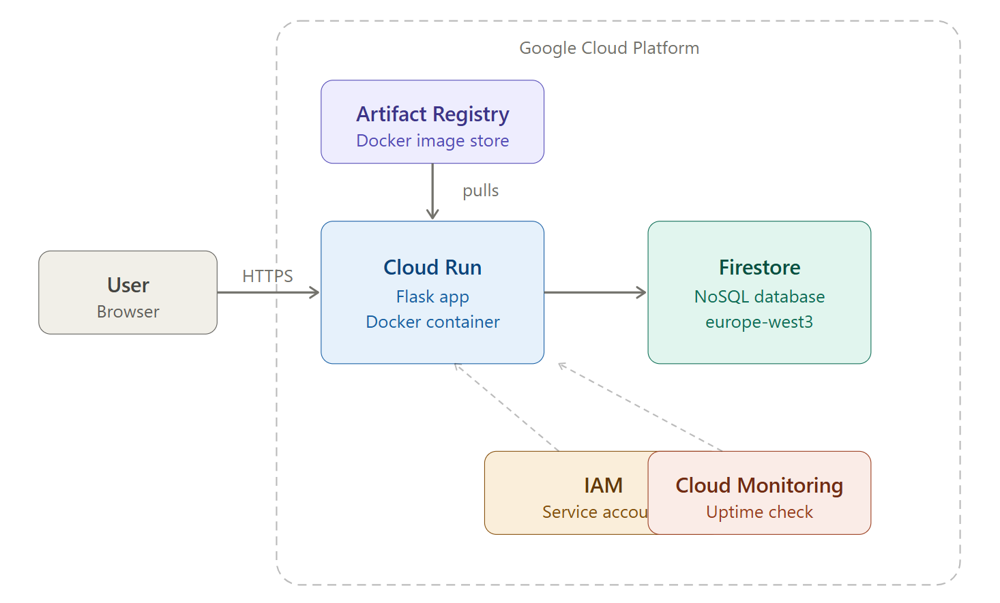

# GCP Inventory Manager

A cloud-native inventory management web application built and deployed on Google Cloud Platform.

## Live Demo
https://inventory-app-567979928693.europe-west3.run.app

## Tech Stack
- **Backend:** Python / Flask
- **Database:** Google Cloud Firestore
- **Containerization:** Docker
- **Container Registry:** Google Artifact Registry
- **Hosting:** Google Cloud Run
- **Security:** IAM Service Account with least-privilege access
- **Monitoring:** Google Cloud Monitoring (Uptime Check)

## Architecture
User → Cloud Run → Flask App (Docker Container) → Firestore

## Features
- Add inventory items (name, quantity, category)
- View all items in real time
- Update item quantity
- Delete items

## Deployment
Built and deployed using Google Cloud CLI:
- Docker image stored in Artifact Registry (europe-west3)
- Deployed to Cloud Run with a dedicated IAM service account
- Firestore database in Native mode (europe-west3)

## Security
- Dedicated service account with minimal permissions (datastore.user)
- Restrictive Firestore security rules
- Cloud Monitoring uptime check configured

## Architecture
